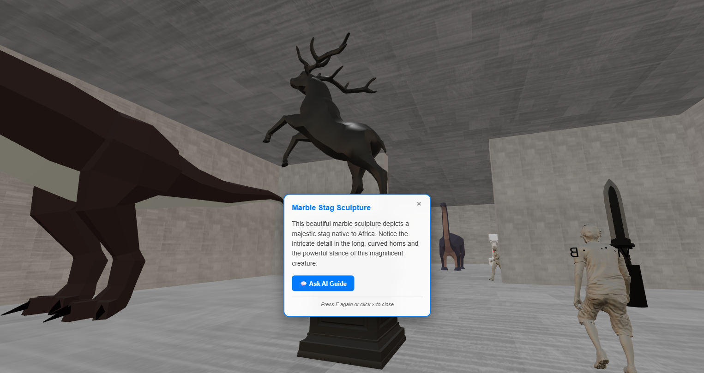
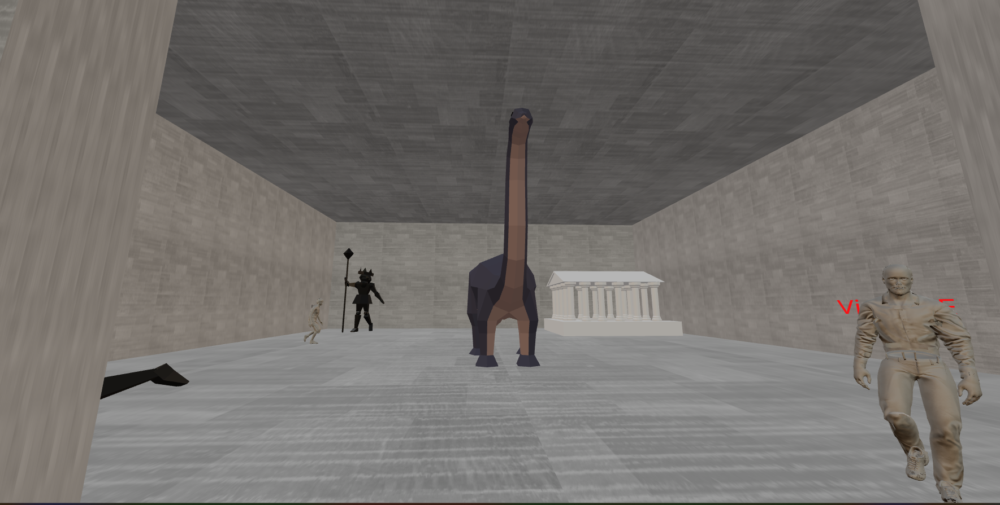
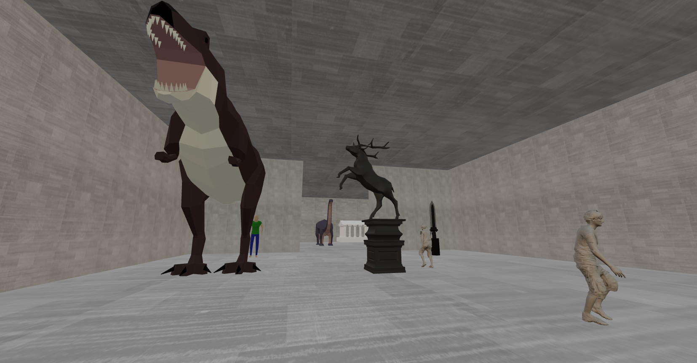

# Virtual Museum

A web-based 3D virtual museum built with React-Three-Fiber and Flask. Explore photorealistic exhibition rooms, interact with sculptures, and chat with an AI museum assistant – all from your browser.






---

## Features

* ⚡ **Immersive 3D Experience** – Navigate realistic museum halls rendered with Three.js & HDRI lighting.
* 🗿 **Interactive Sculptures** – Click or approach exhibits to view info pop-ups and trigger questions for the AI.
* 💬 **AI Chat Assistant** – Press **C** to open the chat box and ask about any exhibit.
* 🌗 **Physically-Based Materials** – Custom metalness / roughness values deliver authentic lighting on floors & models.
* 🛡️ **Collision & Physics** – Walls and invisible colliders keep the player inside the museum space.
* 🔥 **Backend API (Flask)** – Simple Python server stub ready for future expansion (analytics, auth, etc.).

---

## Project Structure

```
Virtual_Museum/
├─ backend/            # Python Flask server
│  └─ app.py
├─ frontend/           # React app (React-Three-Fiber)
│  ├─ public/
│  └─ src/
│     ├─ components/
│     │  ├─ AssistantAvatar.js
│     │  ├─ ChatBox.jsx
│     │  ├─ Floor.js
│     │  ├─ NPC.jsx
│     │  ├─ PlayerControls.js
│     │  ├─ Room.js
│     │  ├─ Sculpture.js
│     │  ├─ WallWithEntry.js
│     │  └─ colliders.js
│     └─ App.js
├─ requirements.txt    # Python deps for backend
├─ package.json        # JS deps for frontend
└─ README.md           # ← you are here
```

---

## Prerequisites

* **Node.js** ≥ 18
* **Python** ≥ 3.10
* A modern desktop browser that supports WebGL2

---

## Installation & Running

### 1. Clone repository (skip if local)
```bash
# using powershell
# git clone https://github.com/Siddhant-Thapa/Virtual-Museum
```

### 2. Frontend
```bash
# install JS dependencies
cd frontend
npm install

# start development server

npm start
# opens http://localhost:3000
```

### 3. Backend (optional for now)
```powershell
python -m venv venv
venv\Scripts\activate
pip install -r requirements.txt
python backend/app.py  # runs on http://localhost:5000
```

> The React app is currently self-contained and does **not** call the Flask API, but the backend is provided for future enhancements.

---

## Controls

| Key | Action |
|-----|--------|
| **W A S D** | Move forward / left / backward / right |
| **Mouse** | Look around |
| **C** | Toggle chat box |
| **Q** | Force-close chat |

---

<!-- ## Adding a Screenshot

1. Run the app and navigate to a representative view.
2. Capture the browser window (Windows: *Win+Shift+S*).
3. Save the image to `docs/screenshot.png` (create folder if needed).
4. Commit the image alongside this README. -->

---

## Deployment

The frontend is a standard Create-React-App build. To create a production bundle:
```bash
npm run build
```
Serve the contents of the `build` directory with any static hosting provider or integrate with services like Netlify, Vercel, or GitHub Pages.

---

